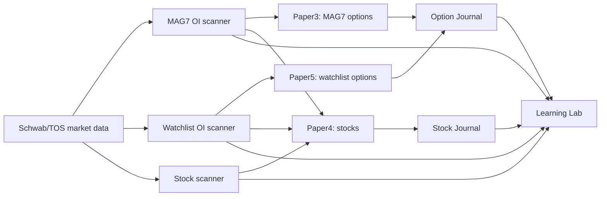
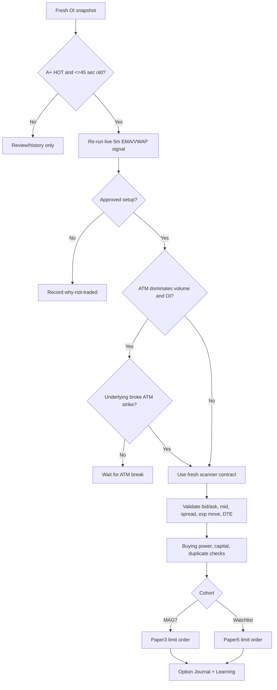
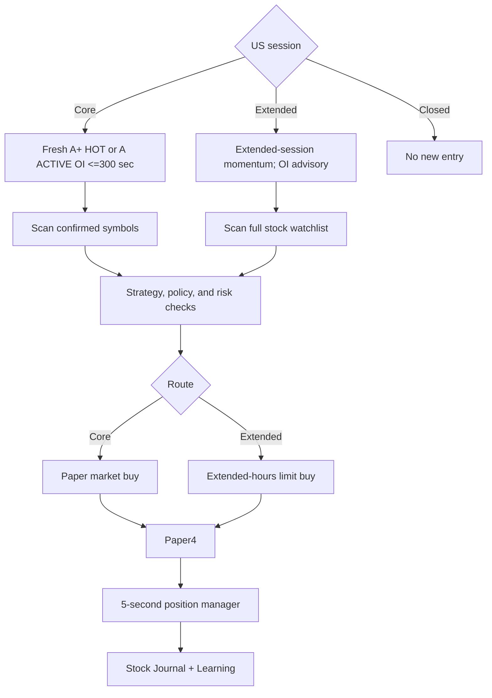
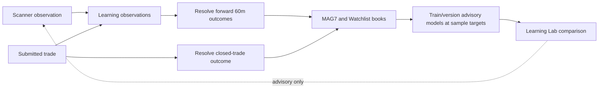
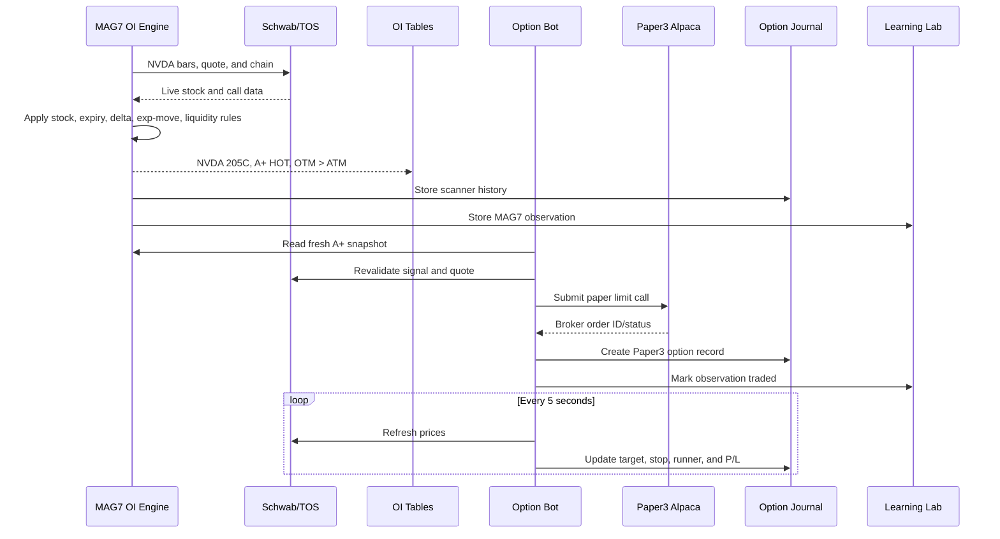
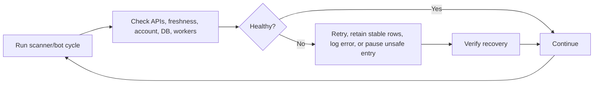

# AgenticAI Trading: End-to-End Workflow

**Code-aligned reference as of July 12, 2026**

This is the complete paper-trading workflow for the MAG7 and approximately 400-symbol watchlist scanners, stock and option bots, Learning Lab, journals, account routing, and health loops. Learning is advisory and cannot block trades by itself.

## 1. Account Map

| Profile | Dashboard label | Purpose | Universe | Product |
|---|---|---|---|---|
| `paper3` | Mag7 OPTION TRADE | MAG7 option orders only | MAG7 underlyings and mapped symbols | Long calls |
| `paper4` | Watchlist Stock trade | All automated stock orders | MAG7 plus stock watchlist | Long stock |
| `paper5` | Watchlist OPTION TRADE | Non-MAG7 watchlist options | Watchlist with MAG7 duplicates removed | Long calls |



Dashboard account cards are dynamic. Adding or removing configured profiles changes the number of displayed account cards without another fixed UI implementation.

## 2. Runtime Engines

| Engine | Current cadence/mode | Responsibility |
|---|---|---|
| MAG7 OI scanner | Full list, target interval 15 seconds | Refresh complete MAG7 option-chain universe |
| Watchlist OI scanner | Five workers, batches of 25, target interval 30 seconds | Scan non-MAG7 watchlist in parallel |
| Stock scanner | 60 seconds | Refresh MAG7 and full-watchlist stock scans |
| Stock scheduler | 60 seconds | Evaluate entries, sync orders, and manage positions |
| Stock position manager | 5 seconds | Check stops, targets, scale-outs, and runners |
| Option scheduler/manager | 5 seconds | Refresh candidates and manage option contracts |
| Learning agent | 300 seconds | Resolve outcomes and update advisory telemetry |

Actual cycle time can exceed the target when chain calls are slow. Scan locks prevent overlapping cycles of the same universe.

## 3. OI Scanner: How Tickers Are Chosen

### 3.1 Universe separation

1. MAG7 uses the editable **MAG7 Scanner** list, including mappings such as `NVDL -> NVDA`, `AMDL -> AMD`, and `METU -> META`.
2. Watchlist OI starts from the stock watchlist.
3. MAG7 underlyings are removed from the watchlist OI universe to prevent duplicates.
4. The current runtime reports 17 MAG7 symbols and 348 non-MAG7 watchlist symbols.

### 3.2 Underlying stock gate

The intended OI stock gate requires all of these:

1. Last price at least **$3.00**.
2. Live daily quote change at least **+1.00%**.
3. A live approved 5-minute setup.
4. EMA trend: **EMA 9 > EMA 21 > EMA 50**.
5. Price above live VWAP.
6. One or more approved setups:
   - EMA + VWAP
   - EMA + VWAP + ORB
   - EMA + VWAP + Premarket High
   - EMA + VWAP + Premarket Low Above Candle
   - EMA + VWAP + Previous Day High
   - EMA + VWAP + Previous Day Low Above Candle
7. RVOL confirmation on at least one of `15m`, `30m`, `1H`, `2H`, `4H`, or `D`.
   - MAG7 threshold: raw RVOL z-score at least **0.40**.
   - Watchlist threshold: raw RVOL z-score at least **1.00**.
   - 5-minute RVOL is early-alert information. A 5m-only alert is review-only.
8. Volume acceleration and EMA9 retest are information/scoring. EMA9 retest is not intended as a hard option-entry gate.

TOS-style RVOL:

```text
average = Average(volume, 50)
standard_deviation = StDev(volume, 50)
raw_rvol = (current_live_bar_volume - average) / standard_deviation
```

The live candle is included. Extended-hours bars are retained from 4:00 AM through 8:00 PM ET.

### Current-code caveat

The OI UI describes the intended gate above. However, `scan_option_chain_liquidity()` currently calls `scanner.run()` without enabling its 1H/4H ignore switches. Therefore the running OI scan can also inherit these stock-scanner comparisons before option-chain analysis:

- live 1H close versus close two bars ago
- live 4H close versus close two bars ago
- live 4H volume versus volume two bars ago

This is stricter than the OI panel label and can explain a missing ticker.

### 3.3 Option contract gate

After the stock stage, Schwab/TOS supplies the option chain. A candidate must pass:

1. Contract is a **CALL**.
2. Strike is above the underlying price (OTM).
3. Delta is at least **0.20**.
4. DTE is greater than zero; expired and 0DTE contracts are excluded.
5. Expiration is inside the symbol-specific near-term window and never beyond 14 days.
   - Multi-expiry names stop at the second-Friday window.
   - Ordinary weekly names may use up to two weeks.
6. Expected move is at least **$2.00**.
7. Volume or open interest is greater than zero.
8. The chain contains usable contract data.

Many contracts may be inspected, but the UI collapses them to one best row per underlying. Ranking favors nearest valid expiration, strongest liquidity, highest volume plus OI, delta near 0.30, then lower strike.

### 3.4 Flow classification

| Label | Calculation | Meaning |
|---|---|---|
| Big real-time volume only | OTM volume > OTM OI | Current-session contract activity leads |
| Big OI only | OTM OI >= OTM volume | Existing positioning leads |
| OTM > ATM | OTM volume + OTM OI > ATM volume + ATM OI | Liquidity favors OTM target |
| ATM > OTM | ATM volume + ATM OI >= OTM volume + OTM OI | Liquidity favors current-price area |

The larger OTM/ATM volume and OI cells are highlighted independently.

### 3.5 UW-style score and eligibility

The capped 0-100 score adds evidence from OTM/ATM volume ratio, OTM/ATM OI ratio, EMA/VWAP, volume acceleration, fast 5m momentum, RVOL, delta, daily change, expected move, volume/OI ratio, premium traded, and DTE.

| Liquidity shape | Score | Result | Trade eligible |
|---|---:|---|---|
| Clean OTM > ATM | 80-100 | A+ HOT | Yes |
| Clean OTM > ATM | 65-79 | A ACTIVE | Stock confirmation only |
| Clean ATM > OTM | 65-100 | A ACTIVE | Stock confirmation; ATM break applies |
| Any clean shape | 50-64 | Watchlist review | No |
| Any clean shape | below 50 | Low/Very Weak review | No |
| Mixed flow/liquidity | any | Mixed Flow review | No |
| 5m RVOL only | any | Watchlist review | No |

The option bot requires **A+ HOT**. The core-session stock bot accepts fresh **A+ HOT or A ACTIVE**.

## 4. OI Tables and Columns

Every table has a Columns menu for visibility and ordering.

| Column | Meaning |
|---|---|
| Symbol | Underlying plus NEW and strength badges |
| Timestamp | Scanner observation time |
| Strength | A+ HOT, A ACTIVE, Watchlist, Mixed Flow, or weaker |
| UW Style Score | 0-100 evidence score |
| Contract | Underlying, expiration, strike, and call |
| Stock Setup | Matched EMA/VWAP setup badges |
| Fast Momentum | Fast 5m confirmations |
| 5M Vol x | Projected live 5m volume / previous 5m volume |
| Buy Pressure | Candle buying-pressure estimate |
| Prev 5M High | Price-action breakout reference |
| Last / Change % | Live underlying price and daily change |
| RVOL 5m through D | Raw TOS-style value for every timeframe |
| RVOL TFs | Confirming timeframes |
| Exp Move / DTE / Delta | Contract constraints |
| OTM Strike / Vol / OI | Selected OTM contract data |
| Vol/OI | OTM volume divided by OTM OI |
| Premium | Mid x volume x 100; call-side estimate |
| ATM Strike / Vol / OI | ATM comparison data |
| Flow Type | Big volume or Big OI badge(s) |
| Liquidity Winner | OTM > ATM or ATM > OTM |
| Setup Type | OTM/ATM momentum or positioning |
| Why | VWAP, EMA, VOL, 5M, ORB, PM/PD level badges |
| Scanner Tag | Compact flow + liquidity summary |

Table placement:

- **SCANNER RESULT MAG7**: trade-quality MAG7 rows
- **WATCHLIST REVIEW MAG7**: mixed/lower-priority MAG7 rows
- **SCANNER RESULT**: trade-quality non-MAG7 watchlist rows
- **WATCHLIST REVIEW**: mixed/lower-priority watchlist rows
- History tables store each timestamped scan event, allowing repeated NVDA rows at 9:30, 9:45, 10:00, and later.

## 5. Option Trade Workflow

New option orders are limited to regular US market hours.



Entry sequence:

1. Scan combined MAG7 + option-watchlist universe.
2. Match a fresh A+ HOT OI snapshot no older than 45 seconds.
3. Recheck live 5m EMA stack, VWAP, and approved setup.
4. If ATM volume and OI both dominate OTM, wait for the underlying to break ATM.
5. If OTM liquidity dominates, target the strongest OTM call directly.
6. Revalidate bid, ask, mid, spread, expected move, and 1-14 DTE.
7. Reject duplicate active underlying, insufficient capital, or insufficient profile buying power.
8. Route MAG7 to Paper3 and watchlist to Paper5.
9. Submit Alpaca paper limit order and store broker IDs.

Management:

- Stop is configured premium percentage; fallback is underlying 5m close below EMA20.
- Target 1 is the OTM liquidity strike or configured premium target.
- Partial exit sells configured contracts/percentage and starts runner state.
- Runner moves to break-even and then locks gains in steps.
- Broker updates, exits, P/L, and reasons update the Option Journal.

## 6. Stock Trade Workflow

All stock orders route to Paper4.



Core session requires fresh A+ HOT/A ACTIVE OI. The OTM liquidity strike may replace the normal stock target. Extended sessions use full momentum rules without requiring OI. Excluded, already-open, low-score, or weak-regime symbols are rejected. `SPY` and `QQQ` are excluded from stock orders; SPY is not a scanner confirmation gate.

Risk lifecycle:

- Initial stop uses the configured 2% per-stock stop and risk amount logic.
- Target 1 uses an OTM liquidity strike above entry, otherwise configured stock target percentage.
- At target 1, sell 80% and move runner to break-even.
- Step the runner stop upward as price extends.
- Stop or live 5m EMA20 break can close the remainder.

## 7. Learning Lab

Learning is isolated from execution. Capture failures are logged and cannot stop scanning or order placement.



| Book | Initial target | Advanced target |
|---|---:|---:|
| MAG7 Stock | 100 | 100 |
| MAG7 Option | 100 | 100 |
| Watchlist Stock | 100 | 100 |
| Watchlist 400 Option | 50 | 150 |

Stored information includes scanner snapshots, cohort, setup, RVOL, price action, OI/volume, liquidity, score, account, session, trade linkage, forward return, favorable/adverse excursion, final P/L, holding time, and exit reason.

Current mode is **advisory only** (`canBlockTrades = false`). Rules and risk controls retain order authority. Learning data/model versions are retained indefinitely until manually archived. Scanner history defaults to 60 days; stock and option journals default to 183 days.

## 8. Journals

### Stock Journal (Paper4)

Stores account, symbol, side, quantity, entry, stop, target, risk, setup, trigger, session, route, scores, rationale, broker IDs, partial exit, runner state, exit, reason, status, and P/L.

### Option Journal (Paper3 and Paper5)

Stores account/cohort, underlying, OCC contract, expiry, strike, delta, bid/ask/mid/spread, expected move, OTM/ATM liquidity, breakout requirement, debit, buying-power check, OI priority, stop/target, partial exit, runner state, broker IDs, exit reason, and P/L.

Scanner history explains what appeared. Journals prove what was submitted and managed.

## 9. MAG7 Example: NVDA

Illustrative values, real code path:

1. MAG7 engine requests NVDA bars, quote, and chain.
2. NVDA is `$202.50`, change `+2.10%`, EMA stacked, above VWAP, with `EMA + VWAP + ORB`.
3. RVOL: `5m 1.20`, `15m 0.65`, `30m 0.52`, `1H 0.30`. MAG7 confirms because 15m/30m exceed 0.40.
4. A 2-DTE `205C` has delta `0.36`, expected move `$5.60`, OTM volume `104,754`, and OTM OI `72,559`.
5. ATM `202.5C` has volume `59,527` and OI `39,549`.
6. OTM wins both metrics, so no ATM-break wait. Hypothetical UW score 88 becomes A+ HOT.
7. One NVDA row displays with timestamp, setup, RVOL values, OTM/ATM metrics, and badges.
8. Scanner history and MAG7 Learning observation are stored.
9. During core hours, stock automation may route NVDA stock to Paper4 using fresh A+/A confirmation.
10. Option automation rechecks the <=45-second snapshot and routes the call to Paper3.
11. Option Journal tracks broker order, target, stop, partial exit, runner, and final P/L.
12. Learning Lab resolves it under the MAG7 Option book without changing live rules automatically.



## 10. Watchlist Example: IBM

1. IBM enters one 25-symbol batch handled by the five-worker watchlist engine.
2. It must pass `$3+`, `+1%` change, EMA/VWAP setup, and watchlist RVOL >=1.00 on a 15m-or-higher timeframe.
3. The chain finds the nearest available ATM strike and eligible 1-14 DTE OTM calls.
4. OTM and ATM volume/OI create flow labels and the strength score.
5. A+/A appears in **SCANNER RESULT**; mixed/weaker flow appears in **WATCHLIST REVIEW**.
6. A qualifying stock trade routes to Paper4.
7. Only A+ HOT can route a watchlist option to Paper5.
8. Scanner history, journal, and Watchlist Learning books remain separate from MAG7.

## 11. Runtime Health and Coding Loops



Runtime health is deterministic and does not rewrite source code. Engineering changes use a separate loop:

```text
generate -> test -> verify -> repeat -> deploy/restart
```

The running trading app should never rewrite or deploy its own strategy during an active session.

## 12. Automated Coding and Runtime Loops

### Coding loop runner

Run a validation-only loop:

```powershell
cd C:\GANESH\AgenticAI-Trading
.\scripts\agentic_coding_loop.ps1
```

Run a bounded generate/test/verify/retry loop with an external coding command:

```powershell
.\scripts\agentic_coding_loop.ps1 `
  -GenerateCommand "your coding-agent command" `
  -MaxAttempts 3
```

On every attempt the runner performs:

1. Optional generator command. The command receives `AGENTIC_LOOP_ATTEMPT` and `AGENTIC_LOOP_REPORT_PATH` environment variables.
2. Python compilation for the backend's core modules.
3. Complete backend unit/integration test discovery.
4. Paper-mode account-routing and database contract verification.
5. Frontend production build.
6. Live backend/frontend health smoke and dynamic account-card reconciliation.

Reports and step logs are written to `artifacts/coding_loop/`. If no generator command is supplied, a failure stops after the first validation attempt because there is no authorized process available to change code.

Use the coding loop after market close or in an isolated development checkout. It does not restart or deploy the active trading app automatically.

### Bilevel experiment loop

For Karpathy-style measured experiments, use the Python bilevel runner instead of allowing a generator to edit the active checkout:

```powershell
.venv\Scripts\python.exe scripts\run_loop_engineering.py `
  --config loop_config.example.json `
  --reset `
  --baseline-only
```

The inner loop copies the current repo into `artifacts/loop_engineering/<run-id>/workspace`, permits edits only to the configured allowlist, runs an immutable JSON-scoring verifier, keeps only score improvements, and restores rejected or unauthorized edits byte-for-byte. State and experiment history persist across runs. After repeated stagnation, the optional outer loop may revise only `program.md` to force a different search direction. It cannot change source code directly.

The loop never commits, merges, deploys, restarts services, or touches broker state. Accepted work is emitted as `champion.patch` for review. After applying an approved patch manually, run `scripts/agentic_coding_loop.ps1` as the full promotion gate.

### Runtime watchdog

The backend starts `agentic-runtime-watchdog` automatically. Every 15 seconds it checks:

- Stock scanner thread and freshness
- MAG7 and watchlist OI scanner threads and freshness
- Stock and option scheduler threads
- Stock position manager
- Learning agent
- SQLite connectivity

With auto-recovery enabled, only a required thread that is actually dead is restarted. Stale-but-running components are marked degraded and logged for inspection rather than duplicated. The watchdog never changes code, thresholds, watchlists, account routing, or trade decisions.

Runtime state is exposed through:

- `GET /api/health`
- `GET /api/status` under `runtimeHealth`
- Dashboard **Automation Health** panel
- `bot_events` records for incidents, recoveries, and watchdog errors

The external `scripts/scanner_watchdog.ps1` remains the process-level layer that restarts backend/frontend processes when ports 3001 or 5173 are down. The in-process watchdog handles worker threads after the backend is alive.
